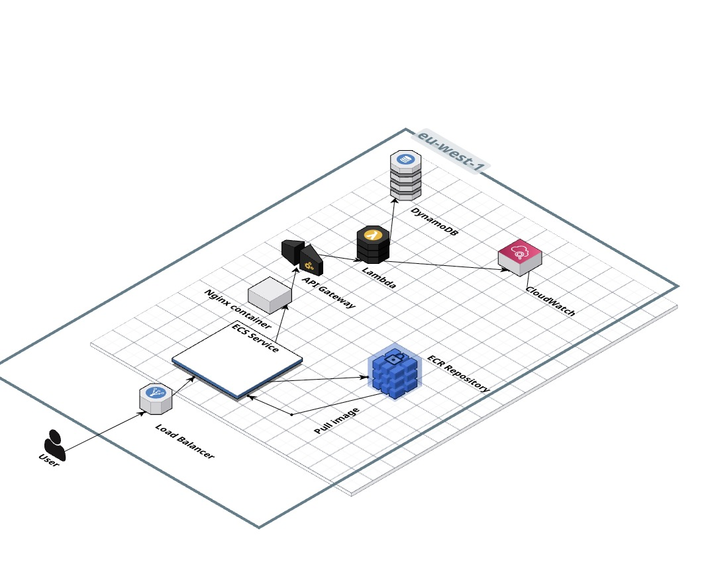
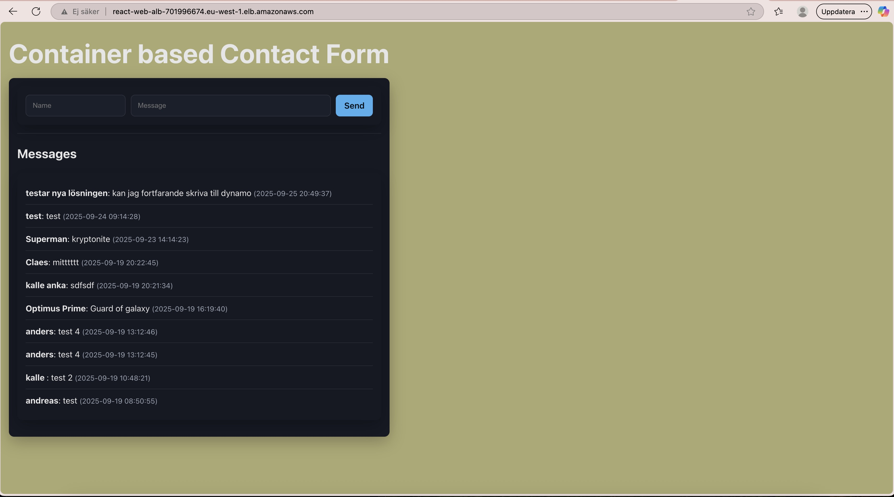
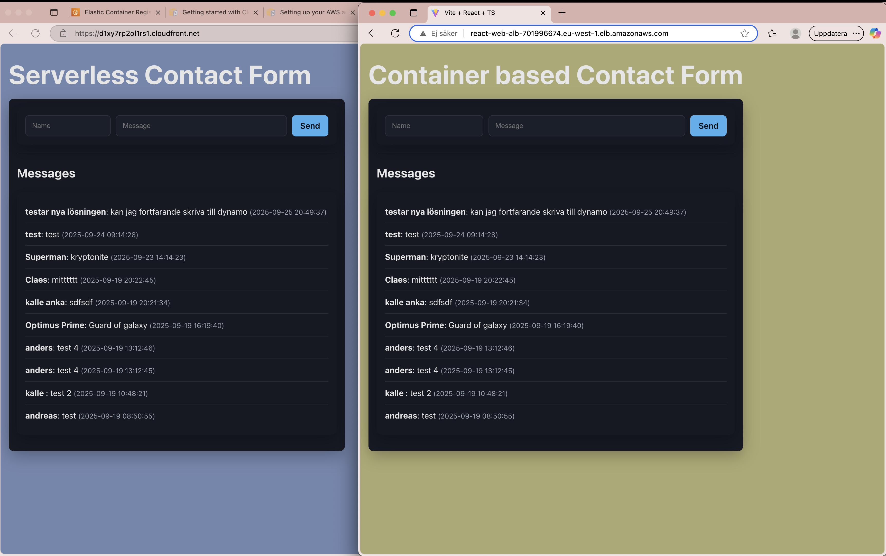
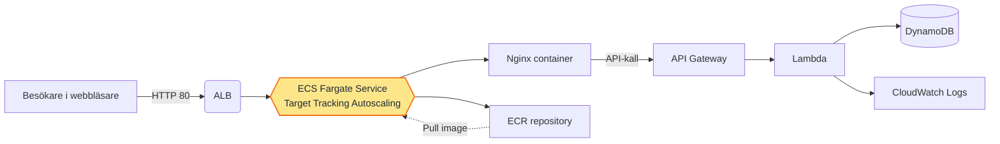

# WebbAppContainer – Projektrapport

## Introduktion

Den här rapporten beskriver hur jag byggde **WebbAppContainer**, en containerbaserad variant av mitt kontaktformulär. Lösningen ersätter architecturen från serverless-projektet med en fullt containeriserad frontend som körs på AWS Fargate, men använder samma backend-API som jag byggde tidigare. Syftet var att lära mig hur man driver en modern React-applikation i ECS, hanterar hela kedjan från Docker build till lastbalanserad drift och jämföra kostnads- och operationsaspekter mot den serverlösa motsvarigheten. Jag
har lärt mig mycket om olika lösningar i AWS och även de stora konsepten inom cloud architecture.

## Mål och omfattning

- Förpacka frontenden i en Docker-image och publicera den i ECR.
- Köra containern på en skalbar Fargate-tjänst bakom ett Application Load Balancer.
- Återanvända det befintliga serverless-API:t utan kodförändringar i backend.
- Automatisera infrastrukturen med Terraform och skapa ett reproducerbart deployflöde. Jag har haft detta som mål och lyckats till 85%.

## Genomförande steg för steg

1. **Förutsättningar för VPC.** Projektet lutar sig mot samma default-VPC som används av alla mina lösningar. Jag angav VPC och publika subnät i `infra/terraform.tfvars` så att både ALB och ECS kan få publik åtkomst via två AZ.
2. **Terraform-initiering.** Med `terraform init`/`apply` skapades ECR-repositoriet och all nätverks- och säkerhetsinfrastruktur enligt filerna i `infra/`. Moduler ersattes inte – allt ligger i ett platt upplägg för att lätt följa resursdefinitionerna.
3. **ECR och behörigheter.** Resursen `aws_ecr_repository.app` (`infra/main.tf:12`) aktiverar scanning on push och `force_delete` så att tidigare resurser rensas automatiskt. IAM-rollerna för ECS execution och task ligger i `infra/ecs.tf:12` respektive `infra/ecs.tf:32` och ger de behörigheter som behövs för att dra bilder från ECR och skriva loggar.
4. **Ladda upp containern.** Jag skrev en tvåstegs Dockerfile (`app/Dockerfile:1`) som bygger React-appen i Node 22 och serverar den statiskt via `nginx:alpine`. `docker buildx build --platform linux/amd64` ser till att imagen kör på Fargates x86_64 runtime.
5. **ECS-kluster och service.** Terraform definierar klustret (`infra/ecs.tf:45`), task definitionen med loggkonfiguration (`infra/ecs.tf:50`) och servicen (`infra/ecs.tf:93`). Target groupens hälsokontroll pekar mot `/index.html` (`infra/alb.tf:66`), vilket var avgörande för att ALB skulle kunna markera containern som frisk.
6. **Frontend-anslutningar.** React-appen hämtar samma API som serverless-versionen via `VITE_API_BASE` (`app/frontend/src/api/client.ts:10`). Formuläret och listan återvinner komponenterna från tidigare projekt (`app/frontend/src/App.tsx:1`), och det finns fortfarande en hook (`app/frontend/src/hooks/useMessages.ts:4`) om jag vill bryta ut logiken senare.
7. **Deployflöde.** Scriptet `deploy.sh` (`deploy.sh:5`) loggar in mot ECR, bygger imagen med en git-baserad tagg, pushar både `latest` och commit-taggen (`deploy.sh:41`), och triggar en rolling update på Fargate (`deploy.sh:51`). När Terraform och scriptet körts kan ALB-url:en öppnas i webbläsaren.
8. **Autoskalning.** Efter att ECS-servicen skapats lägger Terraform till ett App Auto Scaling-target (`infra/ecs.tf:123`) som sätter min/max-kapacitet (1–4 tasks som standard) och en CPU-baserad Target Tracking-policy (`infra/ecs.tf:132`). Policyn skalar ut om genomsnittlig CPU överstiger 50 % och skalar in när lasten sjunker.
9. **Verifikation.** Jag kontrollerade att ALB target group var grön (`Images/targetgroups.jpg`), att containern rullade på två tasks (`Images/ecs.jpg`) och att frontenden fungerade via `Images/frontendUI.jpg`.

## Arkitekturöversikt

Arkitekturen består av fyra huvuddelar:

- Slutanvändaren når applikationen via ett internet-exponerat ALB som lyssnar på port 80 (`infra/alb.tf:49`).
- ALB routar trafiken till ECS Fargate-tasks i två publika subnät som ligger bakom en hårt limiterad säkerhetsgrupp (`infra/alb.tf:33`).
- Containern kör Nginx och levererar den bundlade React-applikationen. Efter att sidan laddats gör JavaScript-anropen vidare till det befintliga serverless-API:t via HTTPS.
- CloudWatch Logs grupperar containerloggar per tjänst (`infra/ecs.tf:6`), och ECR håller containerimagens versioner tillgängliga (`infra/main.tf:12`).
- Autoskalningen håller DesiredCount inom spannet 1–4 tasks och balanserar CPU-last utan manuell inblandning (`infra/ecs.tf:123`).

Resultatet är en klassisk container-setup i AWS där endast frontenden kör i ECS, men backend fortsatt lever i Lambda/API Gateway. Det ger en bra jämförelse i kostnad, svarstider och drift jämfört med S3 + CloudFront-lösningen.

### Arkitekturskiss i Cloudcraft

För att visualisera strukturen skapade jag en Cloudcraft-skiss med följande komponenter:

- `Application Load Balancer` i publika subnät, kopplad till samma säkerhetsgrupp som i Terraform.
- `ECS Fargate Service` med autoskalning (min/max 1–4 tasks) och health check via `/index.html`.
- En "Serverless API"-nod som representerar API Gateway + Lambda-backendet.
- DynamoDB-tabellen `ContactMessages` kopplad till Lambda.

Bilden visar trafikflödet `User → ALB → ECS Service → Serverless API → DynamoDB`.


<small>Architecture bilden visar ALB, autoskalande ECS-tjänster samt kopplingen vidare till det återanvända serverless-API:t och DynamoDB.</small>



<small>Skärmdump från ALB-DNS som bekräftar att React-gränssnittet laddar och kan lista/sända meddelanden mot backend.</small>


<small>CloudFront-distribuerade SPA:n från det tidigare serverless-projektet – kör mot samma API men hostas via S3/CloudFront.</small>

## Flödesdiagram



Auto sker i nod `C`, som är markerad med gul bakgrund i diagrammet.

## Infrastruktur som kod

Terraform-koden är uppdelad efter resurstyp för tydlighet:

- `infra/network.tf:10` validerar den VPC jag pekar ut och återexponerar subnäten som output.
- Säkerhetsgrupperna skiljer på publik åtkomst (ALB) och intern trafik (tasks) i `infra/alb.tf:6` respektive `infra/alb.tf:27`.
- EC2 behövs inte alls – `infra/ecs.tf:50` låser task definitionen till Fargate med `awsvpc`-nätverksmode, `cpu=256` och `memory=512` för att hålla kostnaderna nere.
- Autoskalningsmålet `aws_appautoscaling_target.ecs_service` (`infra/ecs.tf:123`) och CPU-policyn (`infra/ecs.tf:132`) justerar DesiredCount mellan `min_capacity` och `max_capacity`. Trösklarna går att styra via variabler i `infra/variables.tf:42`.
- Variabler som `desired_count`, `health_check_path` och `container_port` är parametriserade (`infra/variables.tf:23`), vilket gjort det lätt att experimentera med fler instanser och andra portar.
- Output-värdena (`infra/outputs.tf:1`) ger mig repository-url:en så att deployscriptet kan lösa fullständigt image-namn.

### Konsolskärmdumpar

- ECR-repositoriet med versionshistorik (`Images/ecr.jpg`, `Images/ecr2.jpg`, `Images/ecr3.jpg`).
- ECS cluster- och servicevy med DesiredCount och autoskalningsgränser (`Images/ecs.jpg`, `Images/ecs2.jpg`).
- ALB listener och target group-status (`Images/alb.jpg`, `Images/alb2.jpg`, `Images/targetgroups.jpg`).
- Frontendgränssnittet efter deploy (`Images/frontendUI.jpg`).

## Applikation och container som jag har lärt mig

- Dockerfilen (`app/Dockerfile:1`) bygger alltid från en ren node-bild med `npm ci`,
  npm ci = clean install från package-lock.json.
  • Installerar exakt samma beroenden varje gång.
  • Ignorerar ev. ändringar i package.json som inte matchar package-lock.json.
  • Snabbare och mer reproducerbart än npm install.

Resultat: samma dependencies i varje build = färre buggar.vilket garanterar reproducerbara builds. Static assets kopieras in i en minimal Nginx-miljö för bästa starttid.

- Frontendens byggkommandon finns i `app/frontend/package.json:6` och körs automatiskt i Dockersteget. Loki testkörning sker lokalt med `npm run dev` innan bygg.
- `App.tsx` (`app/frontend/src/App.tsx:7`) hämtar och skickar meddelanden, visar laddning/felstate och återanvänder komponenterna `MessageForm` och `MessageList`.
- API-klienten (`app/frontend/src/api/client.ts:12`) slår mot `/messages` och är kompatibel med den befintliga DynamoDB-modellen (`id`, `name`, `message`, `createdAt`).
- SCSS-variablerna (`app/frontend/src/styles/_variables.scss:1`) används för att ge container-projektet ett eget tema.

- När vi bygger frontendappen används alltid samma versioner av våra paket.  
  Detta gör att appen fungerar likadant varje gång vi bygger den och vi slipper slumpmässiga buggar.

- När appen är färdigbyggd blir den till vanliga **HTML-, CSS- och JS-filer** som läggs in i en lättviktsserver (**Nginx**).  
  Det gör att appen startar snabbt när den körs i molnet.

- Byggkommandona för frontend ligger i `package.json` (rad 6) och körs automatiskt när vi bygger containern.  
  Innan dess testkör vi lokalt med `npm run dev` för att se att allt fungerar.

- Huvudfilen `App.tsx` ansvarar för att hämta och skicka meddelanden.  
  Den visar också **laddnings- och felmeddelanden** och återanvänder komponenterna `MessageForm` och `MessageList`.

- API-klienten (`client.ts`) pratar med vårt backend-API på `/messages` och använder samma datamodell som databasen:  
  `id`, `name`, `message`, `createdAt`.

- SCSS-variablerna (`_variables.scss`) används för att ge appen sitt tema, så att projektet har en egen **look & feel**.

## Drift- och säkerhetsaspekter

- Maliciös trafik stoppas på två nivåer: ALB-säkerhetsgruppen släpper bara in HTTP på port 80 och task-gruppen accepterar enbart trafik från ALB (`infra/alb.tf:33`).
- `assign_public_ip = true` i `infra/ecs.tf:107` säkerställer utgående internetåtkomst för Nginx (t.ex. för att hämta den serverless-API-destinationen), men jag kan senare växla till NAT + privata subnät.
- Rolling updates styrs av `deployment_minimum_healthy_percent` och `deployment_maximum_percent` (`infra/ecs.tf:103`), vilket ger noll-downtime när en ny image rullas ut. Target Tracking-policyn kompletterar detta genom att automatiskt starta fler tasks när CPU:n blir för hög och minska kapaciteten vid låg last (`infra/ecs.tf:132`).
- LoggRetentionen på 14 dagar (`infra/ecs.tf:6`) balanserar insyn och kostnad.
- Image scanning är påslaget i ECR (`infra/main.tf:15`), vilket ger larm om kända sårbarheter direkt vid push.

## Driftsättning

Helhetsflödet består av tre huvudkommandon:

```bash
# 1. Provisionera eller uppdatera infrastrukturen
cd infra
terraform init
terraform apply

# 2. Bygg och pusha imagen + rulla ut ECS
cd ..
bash deploy.sh

# 3. Validera
aws ecs describe-services --cluster react-web-cluster --services react-web-svc
open http://<alb-dns>
```

Scriptet fångar vanliga misstag (ingen Docker-daemon, avsaknad av Dockerfile) och taggar imagen med både commit-hash och `latest`. AWS CLI-anropet `aws ecs update-service --force-new-deployment` i `deploy.sh:51` säkerställer att den nya imagen används utan att behöva uppdatera task definitionen manuellt.

## Testning och validering

- Manuell sluttest gjordes mot ALB-DNS (`Images/frontendUI.jpg`).
- Target groupens health checks bevakades under utrullning (`Images/targetgroups.jpg`).
- CloudWatch Logs verifierade att Nginx startade och returnerade 200-responser.
- Autoskalningen verifierades genom att simulera last och se att `aws ecs describe-services` rapporterade hur DesiredCount höjdes över 2 när CPU-kravet triggades.
- Lokal utveckling sker fortfarande med `npm run dev` och backendens `sam local start-api`, vilket gör att jag kan testa UI:t snabbt innan en containerbuild.
- För att reglera regressioner planerar jag att använda samma Postman-collection som i serverless-projektet, men komplettera den med ett UI-smoketest mot ALB.

## Jämförelse: Serverless vs Container

| Egenskap                 | Serverless (S3 + CloudFront + Lambda)                                        | Container (ECS Fargate + ALB)                                                                                 |
| ------------------------ | ---------------------------------------------------------------------------- | ------------------------------------------------------------------------------------------------------------- |
| **Deploy-hastighet**     | Snabb – `sam deploy` + S3-sync.                                              | Något långsammare på grund av Docker build och image push.                                                    |
| **Drift & skalning**     | Autoskalning inbyggt i Lambda/API Gateway, ingen task-hantering.             | Autoskalning via Target Tracking (1–4 tasks) kräver egen policy men ger full kontroll över min/max kapacitet. |
| **Kostnadsmodell**       | Pay-per-request och on-demand storage – billig vid låg last.                 | Fargate debiterar per timme och reserv kapacitet, dyrare på låg trafik men förutsägbar vid konstant last.     |
| **Flexibilitet**         | Begränsad till runtime som Lambda stödjer, svårare med avancerade buildsteg. | Fullt containerstöd – valfritt språk/ramverk, eget OS-lager, lättare att porta annan frontend/backend.        |
| **Cachning/Performance** | CloudFront CDN out-of-the-box.                                               | Kräver manuell CDN-lösning (t.ex. CloudFront framför ALB) om global cache önskas.                             |

Generellt passar serverlessversionen bäst för minimal drift och låg trafik, medan containerlösningen ger mer kontroll över runtime och nätverk – på bekostnad av mer infrastruktur att hantera. Båda återanvänder samma backend-API och kan köras parallellt för test och A/B-jämförelser.

## Utmaningar

- Hälsokontrollerna på ALB krävde att jag pekade mot `/index.html`; när jag använde `/` markerades instanserna som sjuka. Det löstes genom `var.health_check_path` (`infra/variables.tf:37`) och dess användning i target groupen.
- Fargate accepterar inte ARM-containers, så på min M1-maskin var `--platform linux/amd64` obligatoriskt (`deploy.sh:41`). Utan det fick jag "exec format error" när tasken startade.
- Jag behövde öka `health_check_grace_period_seconds` till 30 sekunder (`infra/ecs.tf:100`) för att ge Nginx tid att komma upp innan ALB börjar testa den.

## Fortsatt arbete

1. **Aktivera HTTPS**  
   Konfigurera ett ACM-certifikat och sätt upp en `aws_lb_listener` på port **443** så att all trafik går krypterat via HTTPS.

2. **Öka nätverkssäkerheten**  
   Flytta ECS-tasks till **privata subnät** (utan publik IP) och ge dem utgående internetåtkomst via en **NAT Gateway**. Detta minskar exponeringen mot omvärlden.

3. **Automatisera deployment**  
   Bygg ett **GitHub Actions-flöde** som automatiskt kör `terraform plan`, bygger Dockerimagen och rullar ut den till ECS. På så sätt blir releaseprocessen snabbare och mer tillförlitlig.

4. **Införa övervakningstester**  
   Lägg till syntetiska tester (t.ex. **Pingdom** eller **Route53 health checks**) mot lastbalanseraren (ALB) för att tidigt upptäcka om något inte fungerar.

5. **Förbättra autoskalning**  
   Utöka skalningspolicyn med mätvärdet **RequestCount** och/eller införa särskilda **min/max-regler** för lågtrafik på natten, för att optimera kostnad och prestanda.

## Slutsats

Projektet WebbAppContainer visade att vi kan köra samma frontend i en containerbaserad miljö, utan att behöva ändra något i backend. Med hjälp av Terraform, Docker och ett enkelt script kan vi snabbt bygga nya versioner av appen och rulla ut uppdateringar av användargränssnittet. Den här arkitekturen gör att vi får mer kontroll över nätverket och en flexibel grund för att i framtiden lägga till fler delar i containrar. Samtidigt återanvänds samma dataflöde och logik som i den tidigare serverless-lösningen, vilket gör att båda varianterna fungerar sömlöst tillsammans.
